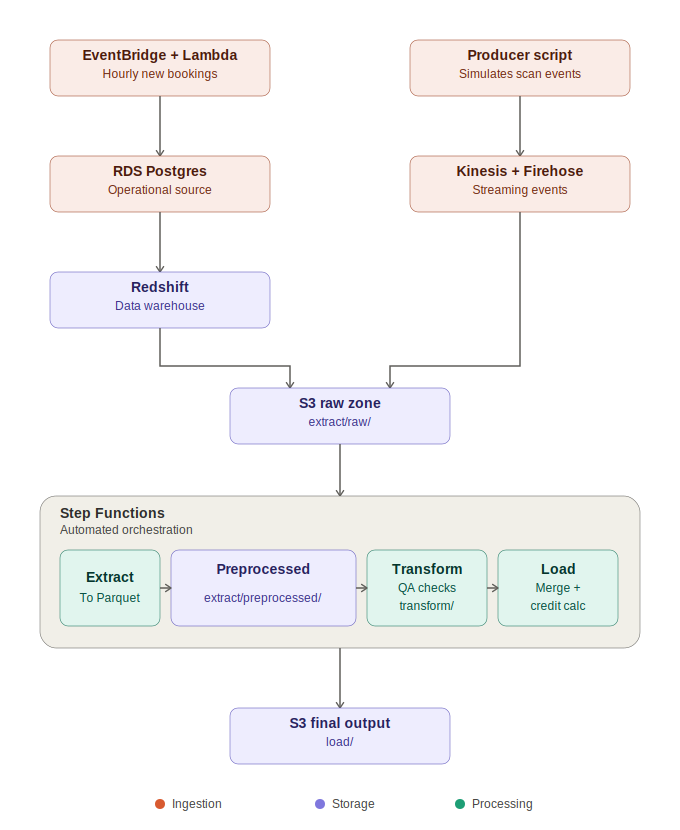

# Shipment Pipeline

An end to end data engineering pipeline that flags late or missed deliveries and forecasts the resulting billing risk. Built as a personal project to practice the kind of batch and streaming ingestion, ETL orchestration, and data quality work I was exposed to during a data engineering focused co-op.

## What this project does

A shipping company needs to know two things about every package: did it get delivered on time, and if it was guaranteed and it didn't, how much does the company owe the customer as a credit. This pipeline answers both questions.

It pulls shipment, billing, and scan event data from real AWS infrastructure, cleans it, figures out whether each shipment breached its delivery promise, and calculates the credit liability for guaranteed shipments that were late. The end result is a Gold layer table ready for reporting or forecasting.

## A note on the data

All the data in this project is synthetic. I wrote a generator that produces realistic shipment, billing, and scan event records (with things like same day cutoff times, external delay factors, and time varying fuel surcharges) so I could build and test a real pipeline without using any actual company data. The architecture and the AWS services involved mirror patterns I learned about in production, rebuilt independently here with fake data.

## Architecture

There are two ways data enters the system, and they represent two different real world patterns:

- Shipment and billing records live in an operational Postgres database (RDS), the same way a booking system would store live transactions. A scheduled job pulls from RDS into Redshift, which acts as the analytics warehouse. Redshift then exports a fresh batch snapshot to S3.
- Scan events (a package getting scanned at a hub) are simulated as a live event stream through Kinesis and Firehose, since that is a more realistic shape for high volume, one at a time event data than a database table.

Both paths land in the same S3 raw zone. From there, three AWS Glue jobs, orchestrated by Step Functions, run in sequence: Extract standardizes the raw files into Parquet, Transform runs data quality checks and figures out delivery outcomes, and Load merges everything and calculates breach status and credit liability.

## Tech stack

- **AWS Glue (PySpark)** for the Extract, Transform, and Load jobs
- **AWS Step Functions** to orchestrate the three Glue jobs in order
- **Amazon Redshift Serverless** as the analytics warehouse
- **Amazon RDS (Postgres)** as the operational source of shipment and billing records
- **Amazon Kinesis Data Streams and Firehose** for the scan event stream
- **AWS Lambda and EventBridge** to simulate new bookings arriving on a schedule
- **Amazon S3** as the data lake, holding raw, preprocessed, transformed, and final output
- **Terraform** to provision all of the above as infrastructure as code
- **Python** (PySpark, psycopg2, redshift_connector, boto3) for the scripts tying everything together
- **Jupyter notebooks and pandas** for the original exploratory build of the transform and forecasting logic

## Repository structure

### `glue_jobs/`
- `extract.py` - reads raw CSV, JSON, and streamed event files, converts everything to typed Parquet, no business logic
- `transform.py` - runs six data quality checks (orphaned or duplicate billing, events, and shipment records), figures out each shipment's first delivery attempt outcome and actual delivery date
- `load.py` - merges everything together, decides if a shipment breached its delivery promise, and calculates credit liability for guaranteed late shipments

### `infra/`
- `main.tf` - every AWS resource in this project, defined as code: the S3 bucket, IAM roles, Glue jobs, Step Functions state machine, Redshift Serverless workgroup, RDS instance, Kinesis stream, Firehose delivery stream, Lambda function, and EventBridge schedule
- `.terraform.lock.hcl` - pins the exact provider versions used, so the infrastructure builds the same way every time

### `notebooks/`
- `01_bronze_silver_transform.ipynb` - the original exploratory build of the cleaning and transform logic, in pandas, before it was rebuilt as Glue jobs
- `02_gold_finance_credit_forecast.ipynb` - forecasting quarterly credit liability by service tier
- `03_gold_ops_fda_report.ipynb` - operational reporting on first delivery attempt success rates

### `redshift/`
- `redshift_schema.sql` - creates the `shipments` and `billing` tables in Redshift
- `rds_schema.sql` - creates the same two tables in RDS, this time with real, enforced primary and foreign keys, since Redshift only documents constraints without checking them
- `sync.sql` - truncates and reloads Redshift's tables from a fresh export of RDS
- `unload.sql` - exports Redshift's tables back out to S3 as the raw batch snapshot the Glue pipeline reads

### Root level Python scripts
- `run_redshift_schema.py` - applies `redshift_schema.sql` to Redshift
- `run_rds_schema.py` - applies `rds_schema.sql` to RDS
- `load_rds_historical_backfill.py` - one time load of historical shipment and billing data into RDS, done through Postgres's native S3 import extension rather than piping data through a local machine
- `run_batch_sync.py` - pulls current data from RDS and reloads it into Redshift, using `sync.sql`
- `run_unload.py` - runs `unload.sql`, exporting Redshift's current data to S3
- `produce_shipments.py` - simulates new bookings by inserting new shipment and billing rows into RDS, run manually or as a one off
- `lambda_produce_shipments.py` - the same booking simulation logic, adapted to run inside AWS Lambda on an hourly EventBridge schedule
- `produce_scan_events.py` - simulates scanners by streaming individual scan events into Kinesis
- `make_samples.py` - generates the small preview files in `sample_data/preview/` from the full synthetic dataset

### `scripts/`
- `generate_synthetic_data.py` - generates the full synthetic dataset (shipments, billing, scan events) with realistic business rules baked in

### `sample_data/`
- `raw/` - the synthetic source files as originally generated
- `output/` - quarantine and data quality artifacts produced by the notebook run (orphaned events, duplicate records, timestamp anomalies, and so on)
- `preview/` - small, truncated versions of the above, kept small enough for GitHub. The full sized data lives in S3, Redshift, and RDS, not in this repository

### Other files
- `.gitignore` - excludes Terraform state, environment variables and credentials, and the full sized data files
- `assets/architecture.svg` - the architecture diagram shown above

## How the pipeline works, end to end

1. **New activity happens.** Every hour, a Lambda function creates a handful of new shipment and billing records in RDS. Separately, a producer script streams scan events into Kinesis.
2. **Batch data gets synced to the warehouse.** A sync job pulls the current state of RDS and reloads it into Redshift.
3. **Redshift exports a snapshot.** Redshift unloads its tables to S3 as CSV, landing in the raw zone. Firehose is doing the same thing for scan events on its own schedule, landing JSON files in the same raw zone.
4. **Step Functions kicks off the pipeline.** Extract, Transform, and Load run in that order, each one waiting for the last to finish.
5. **The final output lands in S3**, ready for reporting or forecasting.

## Data quality checks

The Transform job checks for six categories of bad data before anything gets merged:

- Billing records with no matching shipment
- Duplicate billing records for the same shipment
- Scan events with no matching shipment
- Exact duplicate scan events (the same event ingested twice)
- Duplicate shipment IDs in the shipment table itself
- Shipments with a promised delivery date earlier than their booking date

Every quarantined record gets written to its own folder in S3, tagged with the reason it was flagged, instead of being silently dropped. The pipeline also distinguishes between "this delivery attempt genuinely failed" and "this delivery attempt has bad or missing data" using a separate data quality flag, so the two don't get confused with each other downstream.

## A few design decisions worth knowing about

- **Redshift does not enforce primary or foreign keys.** RDS does. That is one of the real reasons a company would use an operational database as its source of truth rather than the warehouse itself.
- **The historical data in RDS was loaded once, as a backfill**, separate from the ongoing Lambda producer that simulates new activity happening now. Real systems work the same way: a one time migration when something new is stood up, followed by continuous activity from that point on.
- **Redshift's tables get fully truncated and reloaded on each sync**, rather than tracking what changed since the last run. For a dataset this size, that is a simpler and still realistic strategy.
- **Scan events never touch RDS or Redshift at all.** They go straight from Kinesis to S3 through Firehose, since event data at that volume is a better fit for a streaming pipeline than a relational table.

## What's next

- Forecasting models on the Gold layer output (naive baseline, then classical time series methods)
- Unit tests for the transform and quality check logic
- CloudWatch alarms on Glue job failures
